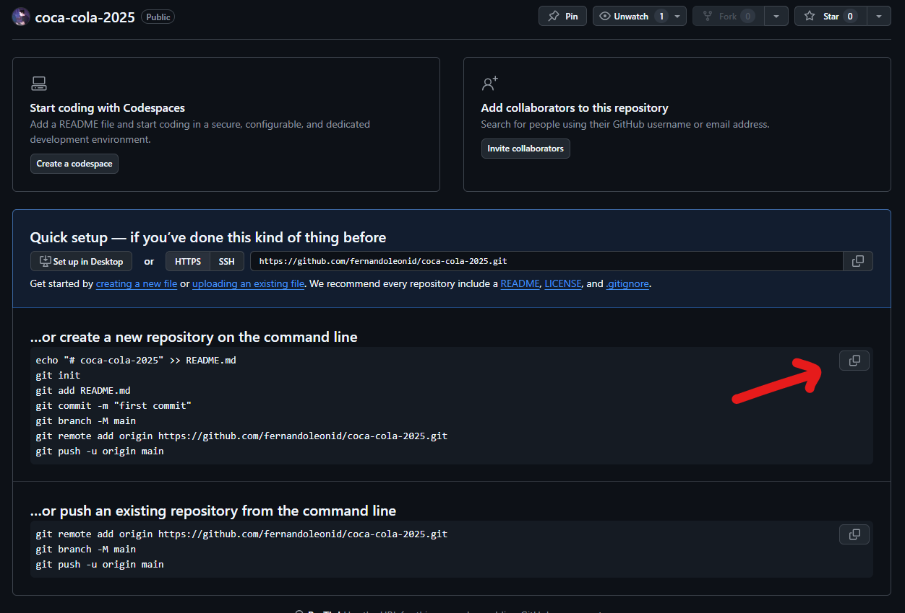

# Projeto Coca-Cola

---

# Criando uma Página Web com HTML e CSS


## 1. Criar um Repositório no GitHub

1. Vá até o [GitHub](https://github.com/) e faça login na sua conta.
2. Clique em **New repository** para criar um novo repositório.
3. Nomeie o repositório, por exemplo: `coca-cola`.
4. Não alter nenhuma opção
5. Clique no botão **Create repository** para criar o repositório.

---

## 2. Criar a Pasta do Projeto Localmente

1. Abra a pasta onde estão seus projetos. 
2. Crie uma nova pasta e nomeie-a `coca-cola`.
3. Abre a pasta com o VSCODE.

---

## 3. Vincular a Pasta Local com o Repositório no GitHub

1. Para isso basta copiar e colar o código fornecido pelo github, como mostra a imagem abaixo:
    

    

<aside>
💡

Lembre para que serve cada linha copiada.

</aside>
    

---

## 4. Criar o `index.html` com as Tags Básicas

1. Abra a pasta no vscode.

1. Crie o arquivo *index.html*. Dentro dele, digite `!` (exclamação) e pressione *Enter*. Isso ativará o Emmet e gerará a estrutura básica do HTML automaticamente. Como mostra abaixo.

```html
<!DOCTYPE html>
<html lang="en">
<head>
    <meta charset="UTF-8">
    <meta name="viewport" content="width=device-width, initial-scale=1.0">
    <title>Document</title>
</head>
<body>
    
</body>
</html>
```

1. Altere, na tag html, o atributo lang para pt-br e na tag title para Coca Cola

```html
<!DOCTYPE html>
<html lang="pt-br">
<head>
    <meta charset="UTF-8">
    <meta name="viewport" content="width=device-width, initial-scale=1.0">
    <title>Coca Cola</title>
</head>
<body>
    
</body>
</html>
```

1. Crie o link para o arquivo css incluindo a tag **link** no **head**
    
    ```html
    <!DOCTYPE html>
    <html lang="pt-br">
    <head>
        <meta charset="UTF-8">
        <meta name="viewport" content="width=device-width, initial-scale=1.0">
        <link rel="stylesheet" href="./style.css">
        <title>Coca Cola</title>
    </head>
    <body>
        
    </body>
    </html>
    ```
    

---

## 5. Criar o `style.css` com Reset Básico

1. No diretório do projeto, crie o arquivo `style.css`
2. Abra o arquivo `style.css` e adicione o reset básico:
    
    ```css
    * {
        padding: 0;
        margin: 0;
        box-sizing: border-box;
    }
    ```
    

---

## 6. Enviar para o GitHub com o Commit "Estrutura básica"

1. Adicione os arquivos ao Git:
    
    ```bash
    git add .
    
    ```
    
2. Faça o commit com a mensagem:
    
    ```bash
    git commit -m "Estrutura básica"
    
    ```
    
3. Envie para o repositório no GitHub:
    
    ```bash
    git push origin main
    
    ```
    
    <aside>
    💡
    
    Como é nosso primeiro push é necessário informar o origin main, nos próximo podemos ignorar.
    
    </aside>
    
4. Verifique na página do GitHub se as mudanças foram aplicadas corretamente.

---

## 7. Criar a Estrutura do `body`: Tags `header`, `main`, e `footer`

1. Abra o arquivo `index.html` e adicione a estrutura do `body`:
    
    ```html
    <body>
        <header>
            <!-- Conteúdo do cabeçalho -->
        </header>
        <main>
            <!-- Conteúdo principal -->
        </main>
        <footer>
            <!-- Rodapé -->
        </footer>
    </body>
    
    ```
    

---

## 8. Estilizar as Tags Criadas

1. Abra o arquivo `style.css` e adicione a estilização básica:
    
    ```css
    body {
        width: 100vw;
        height: 100vh;
        display: flex;
        flex-direction: column;
        background:linear-gradient(#CF2425,#DA6062 50%,#DA6062 60%,#DA3B3F);
    }
    
    header, footer {
        height: 100px;
        background-color: #CF2425;
        color: #FFFFFF;
        display: flex;
        align-items: center;
        justify-content: space-between;
        padding: 0 20px;
    }
    
    main {
        flex-grow: 1;
        display: flex;
        justify-content: center;
        align-items: center;
        background-color: #DA6062;
    }
    
    ```
    

---

## 9. Enviar para o GitHub com o Commit "Adiciona a estrutura do body"

1. Adicione os arquivos ao Git:
    
    ```bash
    git add .
    
    ```
    
2. Faça o commit:
    
    ```bash
    git commit -m "Adiciona a estrutura do body com header, main e footer"
    
    ```
    
3. Envie para o repositório:
    
    ```bash
    git push
    
    ```
    

---

<aside>
💡

Crie uma pasta chamada **img** e adicione as imagens abaixo:

[https://fernandoleonid.github.io/coca-cola-2023/img/menu-burger.svg](https://fernandoleonid.github.io/coca-cola-2023/img/menu-burger.svg)

[https://fernandoleonid.github.io/coca-cola-2023/img/map.svg](https://fernandoleonid.github.io/coca-cola-2023/img/map.svg)

[https://fernandoleonid.github.io/coca-cola-2023/img/background-image.png](https://fernandoleonid.github.io/coca-cola-2023/img/background-image.png)

[https://fernandoleonid.github.io/coca-cola-2023/img/coca-cola.png](https://fernandoleonid.github.io/coca-cola-2023/img/coca-cola.png)

</aside>

### 10. Criar o HTML e o CSS do `header` e Enviar para o GitHub

### HTML do `header`

1. Abra o arquivo `index.html` e adicione o código do `header`:
    
    ```html
    <header>
        
        <span>MENU</span>
    </header>
    
    ```
    

### CSS do `header`

1. Abra o arquivo `style.css` e adicione o CSS para o `header`:
    
    ```css
    header {
        height: 100px;
        display: flex;
        align-items: center;
        gap: 24px;
        color: #FFFFFF;
        padding-left: 75px;
        justify-content: flex-start;
    }
    
    header span {
        font-weight: 600;
    }
    
    ```
    

### Enviar para o GitHub

1. Adicione as mudanças ao Git:
    
    ```bash
    git add .
    
    ```
    
2. Faça o commit com a mensagem:
    
    ```bash
    git commit -m "Adiciona HTML e CSS do header"
    
    ```
    
3. Envie para o GitHub:
    
    ```bash
    git push
    ```
    

---

### 11. Criar o HTML e o CSS do `main` e Enviar para o GitHub

### HTML do `main`

1. Abra o arquivo `index.html` e adicione o código do `main`:
    
    ```html
    <main>
        
        <h2 class="content-text">Things go better with</h2>
        
    </main>
    
    ```
    

### CSS do `main`

1. Abra o arquivo `style.css` e adicione o CSS para o `main`:
    
    ```css
    main {
        flex-grow: 1;
        display: flex;
        justify-content: center;
        align-items: center;
    }
    
    .background-logo {
        position: absolute;
        width: 100%;
        max-height: 100%;
        margin: auto;
        top: 0;
        left: 0;
        right: 0;
        bottom: 0;
        z-index: -1;
    }
    
    .content-text {
        position: absolute;
        color: #ffffff;
        font-size: 2.5rem;
        width: 240px;
        transform: translateX(-100%);
        text-align: end;
    }
    
    .content-image {
        height: 85vh;
    }
    
    ```
    

### Enviar para o GitHub

1. Adicione as mudanças ao Git:
    
    ```bash
    git add .
    
    ```
    
2. Faça o commit com a mensagem:
    
    ```bash
    git commit -m "Adiciona HTML e CSS do main"
    
    ```
    
3. Envie para o GitHub:
    
    ```bash
    git push
    
    ```
    

---

### 12. Criar o HTML e o CSS do `footer` e Enviar para o GitHub

### HTML do `footer`

1. Abra o arquivo `index.html` e adicione o código do `footer`:
    
    ```html
    <footer>
        <div></div>
        <span>Fernando Leonid</span>
        
    </footer>
    
    ```
    
    <aside>
    💡
    
    Troque "Fernando Leonid" para o seu nome
    
    </aside>
    

### CSS do `footer`

1. Abra o arquivo `style.css` e adicione o CSS para o `footer`:
    
    ```css
    footer {
        height: 100px;
        display: flex;
        justify-content: space-between;
        align-items: center;
        padding-right: 75px;
        padding-left: 75px;
        color: #FFFFFF;
        font-weight: 100;
    }
    
    footer div {
        width: 64px;
    }
    
    ```
    

### Enviar para o GitHub

1. Adicione as mudanças ao Git:
    
    ```bash
    git add .
    
    ```
    
2. Faça o commit com a mensagem:
    
    ```bash
    git commit -m "Adiciona HTML e CSS do footer"
    
    ```
    
3. Envie para o GitHub:
    
    ```bash
    git push
    
    ```
    

---

### 13. Tornar a Página Responsiva com Media Queries e Enviar para o GitHub

### CSS para Responsividade

1. Abra o arquivo `style.css` e adicione o seguinte código para media queries:
    
    ```css
    @media (max-width: 768px) {
        header {
            padding-left: 25px;
        }
    
        .content-text {
            transform: translateX(0%);
            top: 80px;
            font-size: 1rem;
            width: 100px;
            text-align: center;
        }
    
        .content-image {
            height: 70vh;
        }
    
        footer {
            padding: 0px 25px;
        }
    }
    
    ```
    

### Enviar para o GitHub

1. Adicione as mudanças ao Git:
    
    ```bash
    git add .
    
    ```
    
2. Faça o commit com a mensagem:
    
    ```bash
    git commit -m "Adiciona responsividade com media queries"
    
    ```
    
3. Envie para o GitHub:
    
    ```bash
    git push
    
    ```
    

---

### 14. Habilitar o GitHub Pages

GitHub Pages permite hospedar sua página diretamente a partir do repositório no GitHub. Aqui está o passo a passo para habilitar o GitHub Pages:

### Passo a passo para habilitar o GitHub Pages:

1. **Acesse seu repositório no GitHub**:
    - Vá até [GitHub](https://github.com/) e acesse o repositório que você deseja hospedar (neste caso, `coca-cola-project`).
2. **Vá para a aba "Settings" (Configurações)**:
    - Na página do repositório, clique em **Settings** na barra de navegação superior.
3. **Encontre a seção "Pages"**:
    - Role a página até encontrar a seção **"Pages"** no menu lateral esquerdo (dentro de **"Code and automation"**).
4. **Escolha a Branch**:
    - Em **Source**, selecione a branch que contém seu projeto (geralmente `master` ou `main`).
    - Após selecionar a branch, escolha o diretório `/root` como a pasta a ser utilizada (raiz do projeto).
5. **Clique em "Save"**:
    - Após selecionar a branch e o diretório, clique no botão **Save**.
6. **Aguarde a Publicação**:
    - Após salvar, o GitHub Pages começará a processar o seu site. Pode levar alguns minutos para que a página esteja online.
    - Você verá um link verde indicando o endereço da página publicada, algo como `https://seu-usuario.github.io/coca-cola-project/`.
7. **Acessar sua Página**:
    - Clique no link fornecido pelo GitHub Pages para visualizar sua página web online.

---

### 15. Criar o `README.md` e Enviar para o GitHub

### Criando o `README.md`

1. No diretório do seu projeto, crie o arquivo `README.md`:
    
    ```bash
    touch README.md
    
    ```
    
2. Abra o arquivo `README.md` e adicione o seguinte conteúdo:
    
    ```
    # COCA-COLA
    
    
    Primeiro website criado, do tipo landing page, para treino no desenvolvimento de sites.
    O site foi desenvolvido utilizando boas práticas, como por exemplo tags semânticas e responsividade.
    
    ## Tecnologias
    * HTML
    * CSS
    * Media Queries
    
    ## Autor
    [Fernando Leonid](<https://www.linkedin.com/in/fernandoleonid/>)
    
    ```
    
    <aside>
    💡
    
    Não esqueça de fazer um print do  site e salvar como coca-cola-preview.png na pasta img.
    
    </aside>
    

### Enviar para o GitHub

1. Adicione o arquivo ao Git:
    
    ```bash
    git add .
    
    ```
    
2. Faça o commit com a mensagem:
    
    ```bash
    git commit -m "Cria o README do projeto"
    
    ```
    
3. Envie para o GitHub:
    
    ```bash
    git push
    
    ```
    

---

<aside>
💡

> Agora, o repositório está completo com um `README.md` que descreve o projeto, suas tecnologias, e o autor. Além disso, a página já está disponível no GitHub Pages.
> 
</aside>

### 16. Questões para responder

Crie um arquivo questoes.txt, dentro do mesmo projeto, e responda as questões abaixo:

1. **O que é um repositório no Git e qual a sua importância?**
2. **Qual a função do Git Bash?**
3. **O que faz o comando `git add` e qual a diferença entre `git add <arquivo>` e `git add .`?**
4. **Por que utilizamos o ponto (`.`) no comando `git add .`?**
5. **Explique o comando `git commit` e por que é importante criar uma mensagem descritiva.**
6. **Qual a função do comando `git push`?**
7. **Qual a importância de criar commits frequentes durante o desenvolvimento de um projeto?**
8. **Explique a função das tags HTML e como elas estruturam uma página.**
9. **O que são atributos em uma tag HTML e qual a sua função?**
10. **O que é o Emmet e como ele facilita o desenvolvimento de páginas HTML?**
11. **O que é o `box-sizing` no CSS e por que usamos ele no reset inicial?**
12. **Por que é importante utilizar tags semânticas no HTML?**
13. **O que são media queries no CSS e qual a sua função?**
14. **Qual a função do GitHub Pages?**
15. **O que é o Flexbox no CSS e para que ele é utilizado?**
16. **Qual a diferença entre `justify-content` e `align-items` em um container Flexbox?**
17. **Como o `flex-grow` funciona e qual o seu propósito no layout Flexbox?**
18. **Explique a diferença entre `flex-direction: column;` e `flex-direction: row;`.**

### 17. Envie o questionario para o github

```bash
git .
git commit -m "questões"
git push
```

### 18. Envie o endereço do repositório do GitHub para as Issues das atividades.
