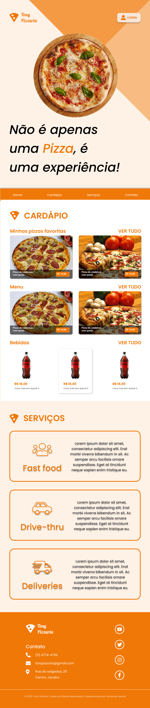

# Projeto Tony Pizzaria

## Objetivo
Desenvolver o site da empres Tony Pizzaria, seguindo o planejado no Figma.

## Protótipo
* [Figma](https://www.figma.com/design/3ZncsZd8O0b4Gb4D9TpkTa/FIC-2023---professor?node-id=17-87&t=MLIMEpSrszhI1QdZ-1)

## Screenshot
* Desktop - Largura 1440px

* Tablet - Largura 768px
  

* Celular - Largura 320px
  